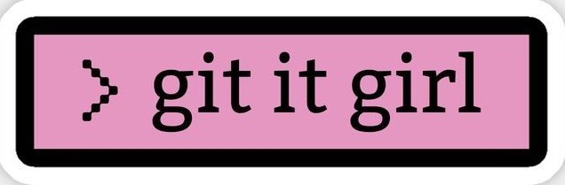

 

# ✨ LILIANA ✨

### `2º DAM Student · Software Developer · Game Dev`

  
  
  
  
  

---

## 👩‍💻 About Me

I'm a **2nd-year DAM student** and aspiring software developer.

I like turning ideas into code, building things from scratch and learning
through every project.

I'm currently focused on **Java, databases, Git/GitHub and game development
with Godot**, while exploring new technologies along the way.

I'm looking for opportunities to keep learning, gain professional experience
and grow as a developer.

`Code · Create · Break · Fix · Repeat`

---

## 🛠️ Technologies & Tools

### 💻 Programming

### 🗄️ Databases

### 🔧 Tools

---

## 🎮 Current Project

### 👾 JuegoMostritos

A small **2D game developed with Godot**.

I'm currently working on:

- Player movement and jumping
- Attack system
- Different enemy behaviors
- Death system
- Traps and hazards
- AnimatedSprite2D animations
- RayCast2D
- Enemy attack detection
- 2D maps

---

## 📊 GitHub Stats

---

### Let's connect

---

# 🎮 A Little Bit About Me

## 🩸 Currently Playing

### SILENT HILL f

---

## 🎵 Now Playing

### Warriors — Immanuel Wilkins

---

# Cat Corner

&nbsp;&nbsp;&nbsp;&nbsp;

  

<code>meow.exe is running...</code>

  

---

## 📚 Currently Learning

 

 

---

 

<h3>Thanks for stopping by!</h3>

